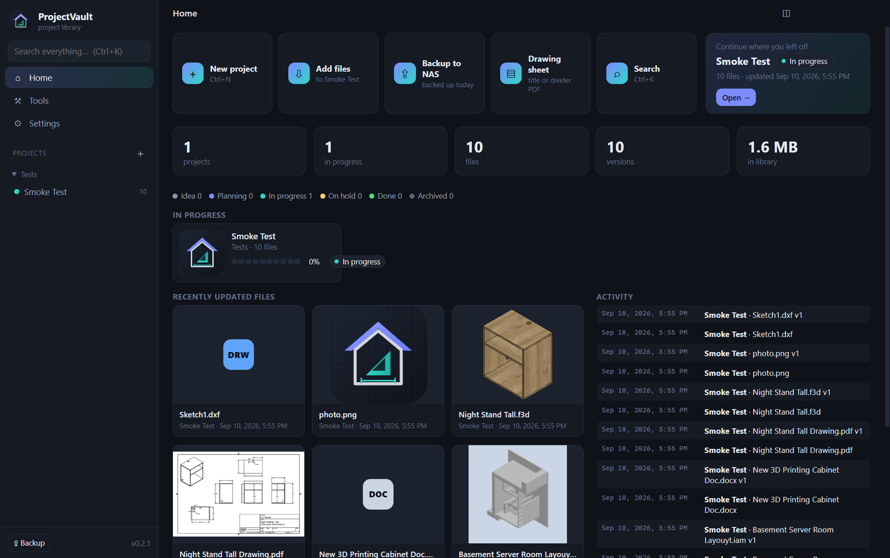
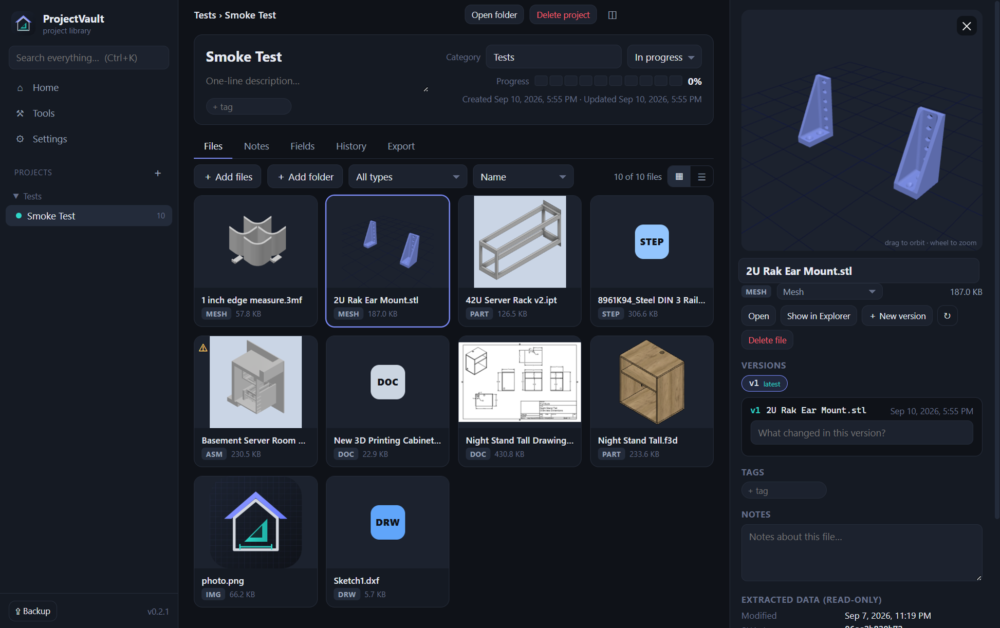
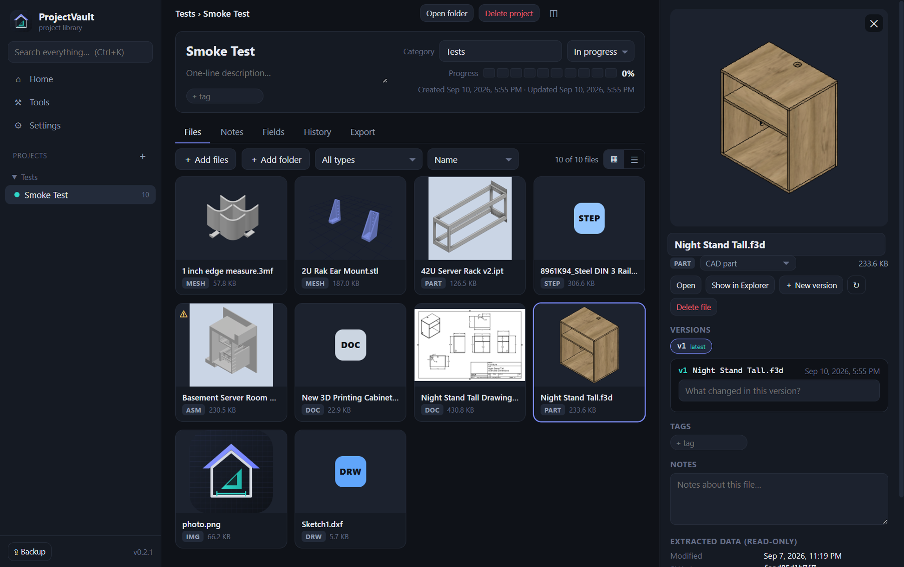
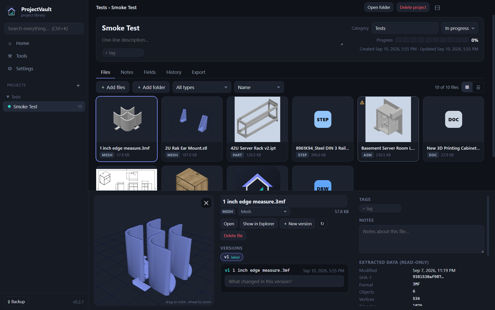
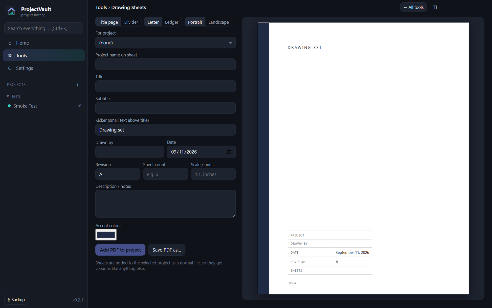
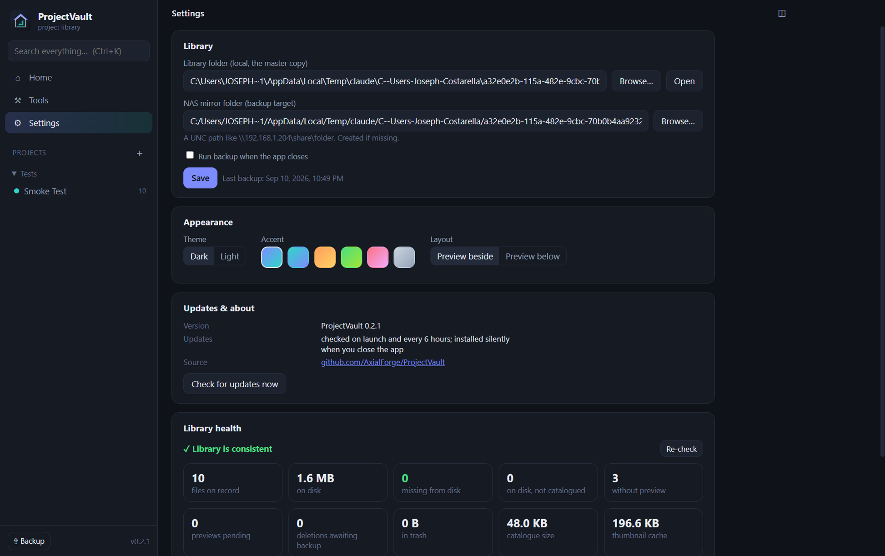

# ProjectVault

Every part, every version, one place.



ProjectVault is a personal project library for makers: a Windows desktop app that
holds CAD files (Fusion 360, SolidWorks, Inventor, FreeCAD), meshes and slicer
files (STL, OBJ, 3MF, G-code), electronics (KiCad), photos, videos, and documents,
sorted by project, with version history, notes, custom fields, previews, and a
one-way mirror to a NAS.

## How it works

- **The library is a folder ProjectVault owns.** Every file you add is copied in
  (never linked), so the folder is self-contained and can be mirrored anywhere.
  Files keep their original names at the top of the project folder so CAD
  assemblies still find their parts.
- **Projects** have a category (becomes a folder), status, progress, tags,
  description, notes, custom fields, and a history log.
- **Versions.** Add a file with the same name again and it becomes v2; the old
  copy moves to `_versions/`. Each version can carry a note.
- **Previews** are read straight out of the files: the embedded thumbnail in
  `.f3d`, `.ipt`/`.iam`, `.sldprt`/`.sldasm`, `.FCStd`, `.3mf`, `.docx` and
  slicer G-code; a rendered view for STL/OBJ/3MF (with a rotatable 3D viewer);
  page one of PDFs; a frame from videos; photos themselves.
- **Extracted data** (read-only) sits beside your own notes: bounding size,
  triangle count, STEP author and product names, DOCX word count, EXIF, KiCad
  footprint counts, print time from G-code, and so on. Assemblies are flagged
  when referenced components are missing from their folder.
- **Search** covers names, tags, notes, field values, extracted data, and the
  text inside PDFs and Office files.
- **Tools** hold add-ins. Drawing Sheets makes title pages and section dividers
  for drawing sets as PDFs (Letter or Ledger) and can drop them straight into a
  project.
- **Export** any project as a zip with all files, older versions, thumbnails, a
  `project.json` and a README, for sharing or archiving.
- **Backup to NAS** copies new and changed files to a mirror folder. Deleting
  anything requires a reason; the file goes to the library's trash, and at the
  next backup its NAS copy is moved into a dated `_Deleted/` folder and logged.
  Nothing on the NAS is ever destroyed.

## Screenshots

**Project view with the 3D viewer.** Files are shown as thumbnails pulled from
the files themselves; STL, OBJ and 3MF open in a rotatable viewer on the right.



**Fusion 360 archive.** The preview is the thumbnail Fusion saved inside the
`.f3d`; the inspector shows the version timeline, tags, notes, and the data
extracted from the file.



**Alternate layout.** The top-bar button moves the preview below the file grid.



**Tools: Drawing Sheets.** Title pages and section dividers for drawing sets,
Letter or Ledger, with a live preview. Saved as PDF or added straight into a
project.



**Settings.** Library and NAS paths, theme and accent colour, layout, updates,
and a library health check that compares the catalogue against the disk.



## Install

Download the latest `projectvault-<version>-setup.exe` from Releases and run it.
It installs per-user with no wizard and updates itself silently from GitHub
Releases.

On first launch, pick a folder for the library (local disk recommended). Set the
NAS mirror path under Settings.

## Develop

```bash
npm install
node node_modules/electron/install.js   # only if allow-scripts blocked the download
npm run vendor      # copy three.js / pdf.js into src/renderer/vendor
npm run icon        # regenerate assets/icon.png + icon.ico from icon.svg
npm run dev         # run from source (separate settings from the installed app)
npm test
npm run dist        # build dist/projectvault-<version>-setup.exe
```

Dev flags: `--devtools`, `--shot=<file.png>` (capture the window after load),
`--item=<id>` (open with a file selected). `npx electron scripts/smoke.js
<libraryFolder> <paths…>` imports files without the GUI and prints what was
extracted.

## Supported formats

| Kind | Extensions | Preview | Data |
| --- | --- | --- | --- |
| CAD part | sldprt, ipt, f3d, FCStd | embedded thumbnail | properties, body count |
| CAD assembly | sldasm, iam, f3z | embedded thumbnail | referenced parts, missing-part check |
| Drawing | slddrw, idw, dxf | thumbnail (OLE) | layers, entity counts |
| Exchange | step/stp, iges | icon | author, system, products, solids, faces |
| Mesh | stl, obj, 3mf | rendered 3D, interactive viewer | size, triangles, volume |
| Electronics | kicad_pcb, kicad_sch | icon | footprints, nets, layers, board size |
| G-code | gcode, gco, nc | slicer thumbnail | slicer, print time, filament, material |
| Photo | jpg, png, gif, webp, bmp, heic, tif | image | EXIF |
| Video | mp4, mov, webm, mkv | frame | duration, dimensions |
| Document | pdf, docx, xlsx, pptx, txt, md, csv | page 1 (PDF) | text for search, pages, words |

Anything else is catalogued with a generic icon and file stats.
